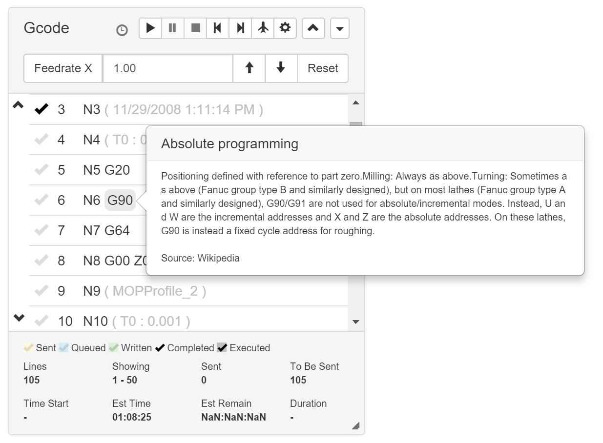

# com-chilipeppr-widget-gcode
The Gcode widget shows you the Gcode loaded into your workspace, lets you send it to the serial port, get back per line status, see an estimated length of time to execute the Gcode, navigate to the XYZ position of a specific line, and much more.



## ChiliPeppr Widget / Gcode v8

All ChiliPeppr widgets/elements are defined using cpdefine() which is a method
that mimics require.js. Each defined object must have a unique ID so it does
not conflict with other ChiliPeppr widgets.

| Item                  | Value           |
| -------------         | ------------- | 
| ID                    | com-chilipeppr-widget-gcode |
| Name                  | Widget / Gcode v8 |
| Description           | The Gcode widget shows you the Gcode loaded into your workspace, lets you send it to the serial port, get back per line status, see an estimated length of time to execute the Gcode, navigate to the XYZ position of a specific line, and much more. |
| chilipeppr.load() URL | http://raw.githubusercontent.com/chilipeppr/widget-gcodelist/master/auto-generated-widget.html |
| Edit URL              | http://ide.c9.io/chilipeppr/widget-gcodelist |
| Github URL            | http://github.com/chilipeppr/widget-gcodelist |
| Test URL              | https://preview.c9users.io/chilipeppr/widget-gcodelist/widget.html |

## Example Code for chilipeppr.load() Statement

You can use the code below as a starting point for instantiating this widget 
inside a workspace or from another widget. The key is that you need to load 
your widget inlined into a div so the DOM can parse your HTML, CSS, and 
Javascript. Then you use cprequire() to find your widget's Javascript and get 
back the instance of it.

```javascript
// Inject new div to contain widget or use an existing div with an ID
$("body").append('<' + 'div id="myDivWidgetGcode"><' + '/div>');

chilipeppr.load(
  "#myDivWidgetGcode",
  "http://raw.githubusercontent.com/chilipeppr/widget-gcodelist/master/auto-generated-widget.html",
  function() {
    // Callback after widget loaded into #myDivWidgetGcode
    // Now use require.js to get reference to instantiated widget
    cprequire(
      ["inline:com-chilipeppr-widget-gcode"], // the id you gave your widget
      function(myObjWidgetGcode) {
        // Callback that is passed reference to the newly loaded widget
        console.log("Widget / Gcode v8 just got loaded.", myObjWidgetGcode);
        myObjWidgetGcode.init();
      }
    );
  }
);

```

## Publish

This widget/element publishes the following signals. These signals are owned by this widget/element and are published to all objects inside the ChiliPeppr environment that listen to them via the 
chilipeppr.subscribe(signal, callback) method. 
To better understand how ChiliPeppr's subscribe() method works see amplify.js's documentation at http://amplifyjs.com/api/pubsub/

  <table id="com-chilipeppr-elem-pubsubviewer-pub" class="table table-bordered table-striped">
      <thead>
          <tr>
              <th style="">Signal</th>
              <th style="">Description</th>
          </tr>
      </thead>
      <tbody>
      <tr valign="top"><td>/com-chilipeppr-widget-gcode/onplay</td><td>When user hits play button. This is fired before this widget starts playing to give subscribers a chance to cancel the play, or delay it, or interrupt it. Payload contains {gcodeLines:(array of gcode lines)}. For example, the Cayenn widget listens for this signal and interrupts you if there are Cayenn commands in your Gcode so it can send a ResetCtr to all Cayenn devices. The Cayenn widget needs to send all the resets before ChiliPeppr is allowed to play to make sure everything is in sync. Return a false from your subscribe callback to cancel the play.</td></tr><tr valign="top"><td>/com-chilipeppr-widget-gcode/onpause</td><td>When user hits pause button. The payload is a true/false boolean indicating whether it is a pause or an unpause. This event also fires if a pause is triggered for a different reason like from an M6 command. In that case the 2nd paramater of the payload contains a string of "m6".</td></tr><tr valign="top"><td>/com-chilipeppr-widget-gcode/onstop</td><td>When user hits stop button</td></tr><tr valign="top"><td>/com-chilipeppr-widget-gcode/resize</td><td>When we resize in case any other widget wants to listen to that so it can resize itself.</td></tr><tr valign="top"><td>/com-chilipeppr-widget-gcode/done</td><td>When we are done sending all gcode. We send a payload of how many lines sent and time for job.</td></tr><tr valign="top"><td>/com-chilipeppr-widget-gcode/recvGcode</td><td>We publish this signal after you send in a /requestGcode signal. We will send you the Gcode in this widget including metadata. The payload contains { lines: [(your lines as a 0-based array)], metadata: [{isSent: bool, isQueued: bool, isWritten: bool, isComplete: bool}] }. The lines are a 0-based array so if you are trying to line them up with the numbers in the Gcode widget, line 1 corresponds to lines[0] in the array. The metadata is an array that matches the lines array but contains data on the send state of each line. You are being sent an exact reference to that array so if you modify it, you are modifying the actual Gcode and Metadata in this widget. You have been warned.</td></tr><tr valign="top"><td>/com-chilipeppr-widget-gcode/onChiliPepprPause</td><td>This event is published during the play operation when the chilipeppr_pause string is found inside the Gcode. You can place a chilipeppr_pause string anywhere in the Gcode inside a comment and it will tell ChiliPeppr to pause sending when it hits that line. <br><br>The pause acts much like the M6 tool change pause but it is a pause just for ChiliPeppr to interpret and not the CNC controller. This technique was implemented for synchronizing a secondary microcontroller that could trigger an out-of-band event like a laser solderer, or a solder paste dispenser, or some other control that had to trigger at a specific Gcode line. This specific event is not very helpful to subscribe to because it does not have as much meaning as onChiliPepprPauseOnComplete or onChiliPepprPauseOnExecute. Those two events are triggered when the CNC controller actually gets to the specifically paused line and that is where you would synchronize from. <br><br>The onChiliPepprPauseOnComplete is triggered by all CNC controllers but is not a very accurate event as most controllers have a planner buffer which means this line is not really what is being executed but will be executed in the very near future at an unknown time. The onChiliPepprPauseOnExecute is a highly accurate event currently only available from TinyG that tells you the CNC controller is exactly executing this line at this moment.<br><br>A sample macro is available that shows how to use the onChiliPepprPause events.</td></tr><tr valign="top"><td>/com-chilipeppr-widget-gcode/onChiliPepprPauseOnExecute</td><td>This event is published when the line that contained the chilipeppr_pause command inside a comment has actually executed in the CNC controller. This is currently supported by TinyG. Grbl does not support this.<br><br>The payload of the event includes the line number and the line of gcode that was just executed like { line: 8, gcode: "(chilipeppr_pause solder drop 4)" }</td></tr><tr valign="top"><td>/com-chilipeppr-widget-gcode/onChiliPepprPauseOnComplete</td><td>This event is published when the line that contained the chilipeppr_pause command inside a comment has been actually sent to the CNC controller. If your controller supports onExecute events then it is recommended you use onChiliPepprPauseOnExecute instead because it is much more accurate.<br><br>To help explain the difference between onChiliPepprPauseOnExecute and onChiliPepprPauseOnComplete, for the onChiliPepprPauseOnComplete event if 1000 lines were buffered to SPJS and this is the 1000th line that this event will only trigger as the 1000th line is dished up to the CNC controller. This gives an event that can be pivoted off of. If the CNC controller has a planner buffer that can hold around 8 moves, you will get this event only when this line of gcode enters the planner buffer. So you are getting the event 8 moves ahead. To make this work in the real world you should likely pause by a length of time to ensure all commands are done or issue a double check command to your CNC controller that sends you back a response where you can ensure the controller is in the correct state.<br><br>The payload of the event includes the line number and the line of gcode that was just completed like { line: 8, gcode: "(chilipeppr_pause solder drop 4)" }</td></tr>    
      </tbody>
  </table>

## Subscribe

This widget/element subscribes to the following signals. These signals are owned by this widget/element. Other objects inside the ChiliPeppr environment can publish to these signals via the chilipeppr.publish(signal, data) method. 
To better understand how ChiliPeppr's publish() method works see amplify.js's documentation at http://amplifyjs.com/api/pubsub/

  <table id="com-chilipeppr-elem-pubsubviewer-sub" class="table table-bordered table-striped">
      <thead>
          <tr>
              <th style="">Signal</th>
              <th style="">Description</th>
          </tr>
      </thead>
      <tbody>
      <tr valign="top"><td>/com-chilipeppr-widget-gcode/requestGcode</td><td>Send in this signal and we will publish back out a /recvGcode signal. See /recvGcode for further info.</td></tr><tr valign="top"><td>/com-chilipeppr-widget-gcode/stop</td><td>Send in this signal to stop the gcode playing. Equivalent to hitting the stop button.</td></tr><tr valign="top"><td>/com-chilipeppr-widget-gcode/play</td><td>Send in this signal to play the gcode. Equivalent to hitting the play button.</td></tr><tr valign="top"><td>/com-chilipeppr-widget-gcode/pause</td><td>Send in this signal to pause/unpause the gcode. Equivalent to hitting the pause button.</td></tr><tr valign="top"><td>/com-chilipeppr-widget-gcode/jumpToLine</td><td>Send in an integer of what line to jump to in the Gcode widget. The index you send it should match what visually shows in the Gcode widget, i.e. line 1 should be sent as a 1 (even though the backing array is index 0).</td></tr>    
      </tbody>
  </table>

## Foreign Publish

This widget/element publishes to the following signals that are owned by other objects. 
To better understand how ChiliPeppr's subscribe() method works see amplify.js's documentation at http://amplifyjs.com/api/pubsub/

  <table id="com-chilipeppr-elem-pubsubviewer-foreignpub" class="table table-bordered table-striped">
      <thead>
          <tr>
              <th style="">Signal</th>
              <th style="">Description</th>
          </tr>
      </thead>
      <tbody>
      <tr valign="top"><td>/com-chilipeppr-widget-gcode/com-chilipeppr-widget-3dviewer/gcodeline</td><td>When a user clicks a line of gcode. We'll send the gcode and the line number so the subscriber can sync to what we're sending, i.e. a 3D viewer that wants to hilite the line representing this command. The format of the signal data is something like {line: 12, gcode: "G1 F300.0 Z0.0"}.</td></tr><tr valign="top"><td>/com-chilipeppr-widget-gcode/com-chilipeppr-elem-flashmsg/flashmsg</td><td>Send a flash message on certain events. In particular, we send a flash message when a comment line is hit. We also send a flash message when the gcode is done sending.</td></tr>    
      </tbody>
  </table>

## Foreign Subscribe

This widget/element publishes to the following signals that are owned by other objects.
To better understand how ChiliPeppr's publish() method works see amplify.js's documentation at http://amplifyjs.com/api/pubsub/

  <table id="com-chilipeppr-elem-pubsubviewer-foreignsub" class="table table-bordered table-striped">
      <thead>
          <tr>
              <th style="">Signal</th>
              <th style="">Description</th>
          </tr>
      </thead>
      <tbody>
      <tr valign="top"><td>/com-chilipeppr-widget-gcode/com-chilipeppr-elem-dragdrop/ondropped</td><td>We watch for a drag drop event of the Gcode file. The payload of the signal contains the localStorage object which is just the string representing the entire Gcode file.</td></tr><tr valign="top"><td>/com-chilipeppr-widget-gcode/com-chilipeppr-interface-cnccontroller/plannerpause</td><td>We need to pause when planner tells us.</td></tr><tr valign="top"><td>/com-chilipeppr-widget-gcode/com-chilipeppr-interface-cnccontroller/plannerresume</td><td>We need to resume when planner tells us.</td></tr><tr valign="top"><td>/com-chilipeppr-widget-gcode/com-chilipeppr-interface-cnccontroller/feedhold</td><td>We need to place a manual pause if we see the e-stop hit. That way user can start where they left off.</td></tr><tr valign="top"><td>/com-chilipeppr-widget-gcode/com-chilipeppr-interface-cnccontroller/onExecute</td><td>This signal is sent to us by the CNC controller widget. The payload looks like { line: 234 }. It is ONLY sent if the CNC controller widget is able to determine an executed state. Please refer to your CNC controller's publish documenation to determine if this signal will be published and thus whether this Gcode widget will see these events.</td></tr>    
      </tbody>
  </table>

## Methods / Properties

The table below shows, in order, the methods and properties inside the widget/element.

  <table id="com-chilipeppr-elem-methodsprops" class="table table-bordered table-striped">
      <thead>
          <tr>
              <th style="">Method / Property</th>
              <th>Type</th>
              <th style="">Description</th>
          </tr>
      </thead>
      <tbody>
      <tr valign="top"><td>id</td><td>string</td><td>"com-chilipeppr-widget-gcode"</td></tr><tr valign="top"><td>url</td><td>string</td><td>"http://raw.githubusercontent.com/chilipeppr/widget-gcodelist/master/auto-generated-widget.html"</td></tr><tr valign="top"><td>fiddleurl</td><td>string</td><td>"http://ide.c9.io/chilipeppr/widget-gcodelist"</td></tr><tr valign="top"><td>githuburl</td><td>string</td><td>"http://github.com/chilipeppr/widget-gcodelist"</td></tr><tr valign="top"><td>testurl</td><td>string</td><td>"http://widget-gcodelist-chilipeppr.c9users.io/widget.html"</td></tr><tr valign="top"><td>name</td><td>string</td><td>"Widget / Gcode v8"</td></tr><tr valign="top"><td>desc</td><td>string</td><td>"The Gcode widget shows you the Gcode loaded into your workspace, lets you send it to the serial port, get back per line status, see an estimated length of time to execute the Gcode, navigate to the XYZ position of a specific line, and much more."</td></tr><tr valign="top"><td>publish</td><td>object</td><td>Please see docs above.</td></tr><tr valign="top"><td>subscribe</td><td>object</td><td>Please see docs above.</td></tr><tr valign="top"><td>foreignSubscribe</td><td>object</td><td>Please see docs above.</td></tr><tr valign="top"><td>foreignPublish</td><td>object</td><td>Please see docs above.</td></tr><tr valign="top"><td>fileLines</td><td>object</td><td></td></tr><tr valign="top"><td>metaLines</td><td>object</td><td></td></tr><tr valign="top"><td>metaObj</td><td>object</td><td></td></tr><tr valign="top"><td>linesComplete</td><td>object</td><td></td></tr><tr valign="top"><td>linesToShow</td><td>number</td><td></td></tr><tr valign="top"><td>linesToShowMax</td><td>number</td><td></td></tr><tr valign="top"><td>delayPerLine</td><td>number</td><td></td></tr><tr valign="top"><td>lineNumbersOnByDefault</td><td>boolean</td><td></td></tr><tr valign="top"><td>isDirtyUnits</td><td>boolean</td><td></td></tr><tr valign="top"><td>init</td><td>function</td><td>function (settings) </td></tr><tr valign="top"><td>setupSecondaryButtons</td><td>function</td><td>function () <br><br>Configure the "Feed Rate Override" button and the "Tool Changes" pulldown</td></tr><tr valign="top"><td>onToggleShowFeedRateOverride</td><td>function</td><td>function () </td></tr><tr valign="top"><td>toolChanges</td><td>object</td><td>This method scans the Gcode for tool changes and then populates the pulldown menu so
you can easily jump to the changes in the file and continue where you left off.</td></tr><tr valign="top"><td>toolChangesKeys</td><td>object</td><td></td></tr><tr valign="top"><td>toolComments</td><td>object</td><td></td></tr><tr valign="top"><td>setupToolChanges</td><td>function</td><td>function () </td></tr><tr valign="top"><td>onToolChangesSelectMenu</td><td>function</td><td>function (data) <br><br>Called when user clicks a Tool Changes menu item. They want to jump to that line.</td></tr><tr valign="top"><td>onAfterGcodeFileLoaded</td><td>function</td><td>function () <br><br>This method is called after the Gcode file is loaded so you can do some post-processing.</td></tr><tr valign="top"><td>setupJumpToLine</td><td>function</td><td>function () </td></tr><tr valign="top"><td>onJumpToLine</td><td>function</td><td>function (evt) </td></tr><tr valign="top"><td>getEstimates</td><td>function</td><td>function () </td></tr><tr valign="top"><td>setupStatusSteps</td><td>function</td><td>function () </td></tr><tr valign="top"><td>setupPlayPauseStopPubSub</td><td>function</td><td>function () </td></tr><tr valign="top"><td>setupSendGcodePubSub</td><td>function</td><td>function () </td></tr><tr valign="top"><td>publishGcode</td><td>function</td><td>function () </td></tr><tr valign="top"><td>options</td><td>object</td><td></td></tr><tr valign="top"><td>setupOptionsModal</td><td>function</td><td>function () </td></tr><tr valign="top"><td>saveOptionsModal</td><td>function</td><td>function () </td></tr><tr valign="top"><td>showOptionsModal</td><td>function</td><td>function () </td></tr><tr valign="top"><td>hideOptionsModal</td><td>function</td><td>function () </td></tr><tr valign="top"><td>setupToolChangeModal</td><td>function</td><td>function () </td></tr><tr valign="top"><td>isInToolChangeMode</td><td>boolean</td><td></td></tr><tr valign="top"><td>toolChangeRepositionCmd</td><td>object</td><td></td></tr><tr valign="top"><td>toolChangeCmd</td><td>object</td><td></td></tr><tr valign="top"><td>showToolChangeModal</td><td>function</td><td>function (linegcode, source) </td></tr><tr valign="top"><td>hideToolChangeModal</td><td>function</td><td>function () </td></tr><tr valign="top"><td>hideToolChangeDiv</td><td>function</td><td>function (wasPaused) </td></tr><tr valign="top"><td>showUOMModal</td><td>function</td><td>function (txt, info, skipLocalStore)</td></tr><tr valign="top"><td>hideUOMModal</td><td>function</td><td>function ()</td></tr><tr valign="top"><td>setUOM</td><td>function</td><td>function (txt, info, skipLocalStore, units)</td></tr><tr valign="top"><td>getCoordFromControllerRecvCallback</td><td>object</td><td></td></tr><tr valign="top"><td>getCoordFromController</td><td>function</td><td>function (callback) </td></tr><tr valign="top"><td>getCoordFromControllerRecv</td><td>function</td><td>function (coords) </td></tr><tr valign="top"><td>getMotorConfigCallback</td><td>function</td><td>function (data) </td></tr><tr valign="top"><td>getXyzCoordsForLineRecv3dObjCallback</td><td>object</td><td></td></tr><tr valign="top"><td>getXyzCoordsForLineRecv3dObjLine</td><td>object</td><td></td></tr><tr valign="top"><td>obj3d</td><td>object</td><td></td></tr><tr valign="top"><td>getXyzCoordsForLine</td><td>function</td><td>function (line, callback) </td></tr><tr valign="top"><td>getXyzCoordsForLineRecv3dObj</td><td>function</td><td>function (obj3d) </td></tr><tr valign="top"><td>btnSetup</td><td>function</td><td>function () <br><br>This method is called after the Gcode file is loaded so you can do some post-processing.
/
onAfterGcodeFileLoaded: function() {
this.setupToolChanges();
},
setupJumpToLine: function() {
$('#com-chilipeppr-widget-gcode-jumptoline').click(this.onJumpToLine.bind(this));<br><br>},
onJumpToLine: function(evt) {
console.log("got onJumpToLine. evt:", evt);
console.log("this.lastLineMarkedExecuted:", this.lastLineMarkedExecuted);<br><br>var lastLine = "";
if (this.lastLineMarkedExecuted && this.lastLineMarkedExecuted > 0)
lastLine = this.lastLineMarkedExecuted;<br><br>var line = prompt("Please enter the line number to jump to.", lastLine);
var lineNum = parseInt(line);
if (lineNum > 0)
chilipeppr.publish("/com-chilipeppr-widget-gcode/jumpToLine", lineNum);
else
chilipeppr.publish("/com-chilipeppr-elem-flashmsg/flashmsg", "Error on Line Jump", "We had a problem parsing the line number you gave us.", 1000, true);
},
getEstimates: function() {
var that = this;
this.get3dObj(function() {
// when we get this callback, we should have a 3dobj
console.log("getEstimates got obj3d:", this.obj3d);
if (this.obj3d && this.obj3d.userData && this.obj3d.userData.lines) {
var lastLine = this.obj3d.userData.lines[this.obj3d.userData.lines.length - 1];
if ('p2' in lastLine && 'timeMinsSum' in lastLine.p2) {
console.log("we got a timeMinsSum:", lastLine.p2.timeMinsSum);
var estDurMins = lastLine.p2.timeMinsSum;
var str = this.toHHMMSS(estDurMins * 60); // expect seconds
$('#com-chilipeppr-widget-gcodeviewer #gcode-time-est').text(str);
}
}
});
},
setupStatusSteps: function() {
var html = 
"<div id=\"com-chilipeppr-widget-gcodeviewer-popover-steps\" >Your Gcode moves through 5 steps from ChiliPeppr all the way through execution." +
"<table class=\"table table-condensed table-striped\"><tr><th>Step&nbsp;</th><th>Status</th><th>Description</th></tr>" + 
"<tr><td>1</td><td><span class=\"glyphicon glyphicon-ok gcode-sent\"></span> Sent</td><td>Your Gcode has been sent to the Serial Port JSON Server by the Serial Port Widget.</td></tr>" + 
"<tr><td>2</td><td><span class=\"glyphicon glyphicon-ok gcode-queued\"></span> Queued</td><td>Gcode is queued inside the Serial Port JSON Server and waiting to be sent to the CNC controller's serial buffer.</td></tr>" + 
"<tr><td>3</td><td><span class=\"glyphicon glyphicon-ok gcode-written\"></span> Written</td><td>Gcode has been written to the serial buffer of your CNC controller and removed from SPJS's buffer. </td></tr>" + 
"<tr><td>4</td><td><span class=\"glyphicon glyphicon-ok gcode-completed\"></span>&nbsp;Completed&nbsp;</td><td>Gcode is completed when the CNC controller tells us it read the Gcode from its serial buffer and placed the Gcode into its planner buffer (this means the Gcode may only get executed seconds into the future as the planner buffer works its way through lines.) </td></tr>" + 
"<tr><td>5</td><td><span class=\"glyphicon glyphicon-ok gcode-executed\"></span> Executed</td><td>Optional. The CNC controller tells us that your Gcode was actually executed. This is the final step. On controllers like TinyG this data only comes back if line numbers are in your Gcode.</td></tr>" +
"<tr><td>6</td><td><span class=\"glyphicon glyphicon-ok gcode-error\"></span> Error/Unsupported Command</td><td>Optional. The CNC controller failed to execute the line of gcode.  This could indicate a problem with your gcode syntax, or that your CNC controller does not understand a particular gcode command.</td></tr>" +
"</table></div>";
$("#com-chilipeppr-widget-gcodeviewer .stats-hdr").popover({
content: html
})
.on("show.bs.popover", function(){ $(this).data("bs.popover").tip().css("max-width", "600px"); });
},
setupPlayPauseStopPubSub: function() {
var that = this;
/*chilipeppr.subscribe("/" + this.id + "/play", this, function() { that.onPlay(true); } );
chilipeppr.subscribe("/" + this.id + "/pause", this, function() { that.onPause(true); } );
chilipeppr.subscribe("/" + this.id + "/stop", this, function() { that.onStop(true); } );*/
chilipeppr.subscribe("/" + this.id + "/play", this, function() { that.onPlay({}); } );
chilipeppr.subscribe("/" + this.id + "/pause", this, function() { that.onPause({}); } );
chilipeppr.subscribe("/" + this.id + "/stop", this, function() { that.onStop({}); } );<br><br>},
setupSendGcodePubSub: function() {
chilipeppr.subscribe("/" + this.id + "/requestGcode", this, this.publishGcode);
},
publishGcode: function() {
var gcode = {
lines: this.fileLines,
metadata: this.metaLines
}
chilipeppr.publish("/" + this.id + "/recvGcode", gcode);
},
// options: stores the cookie settings for the user
// example: {whenPlay: "serial", perRow: "3d", perRow3dType: "goto"}
// it is set during the setupOptionsModal()
options: null,
setupOptionsModal: function() {
console.log("setupOptionsModal");
// read vals from cookies
var options = $.cookie('com-chilipeppr-widget-gcode-options');<br><br>if (true && options) {
options = $.parseJSON(options);
console.log("just evaled options: ", options);
if (!('removeemptylines' in options))
options.removeemptylines = true;
// only addlinenumbs by default if workspace asked us to
if (this.lineNumbersOnByDefault) {
if (!('addlinenums' in options))
options.addlinenums = true;
}
// Default new options for backwards compatibility
if (!('sendOnM6' in options)) {
options.sendOnM6 = "";
}
if (!('sendOffM6' in options)) {
options.sendOffM6 = "";
}
if (!('probeCmd' in options)) {
options.probeCmd = "G28.2 Z0";
}<br><br>} else {
options = {whenPlay: "serial", perRow: "3d", perRow3dType: "goto", delayPerLine: this.delayPerLine, pauseOnM6: true, preUpload: 'none', multiLineMode: 'yes', multiLines: 50, ppsOnPlayFlush: false, ppsOnStopFeedhold: false, ppsOnPauseFeedhold: false, ppsOnUnpauseResume: false, removeemptylines: true, addlinenums: true, sendOnM6: "", sendOffM6: "", probeCmd: "G28.2 Z0"};
}
this.options = options;
console.log("options:", options);<br><br>// setup the correct radio buttons in dialog
if (this.options.whenPlay == "serial")
$('#com-chilipeppr-widget-gcode-option-whenplay-serial').prop('checked', true);
else
$('#com-chilipeppr-widget-gcode-option-whenplay-3d').prop('checked', true);
if (this.options.perRow == "serial")
$('#com-chilipeppr-widget-gcode-option-perrow-serial').prop('checked', true);
else
$('#com-chilipeppr-widget-gcode-option-perrow-3d').prop('checked', true);
if (this.options.perRow3dType == "goto")
$('#com-chilipeppr-widget-gcode-option-perrow-3d-goto').prop('checked', true);
else
$('#com-chilipeppr-widget-gcode-option-perrow-3d-anim').prop('checked', true);<br><br>if (this.options.pauseOnM6) {
$('#com-chilipeppr-widget-gcode-option-pauseOnM6').prop('checked', true);
$('#com-chilipeppr-widget-gcode-option-pauseOnM6-alt').prop('checked', true);
}
$('#com-chilipeppr-widget-gcode-option-sendonM6').val(this.options.sendOnM6);
$('#com-chilipeppr-widget-gcode-option-sendoffM6').val(this.options.sendOffM6);
$('#com-chilipeppr-widget-gcode-option-probe-cmd').val(this.options.probeCmd);<br><br>if (this.options.preUpload) {
var opt = ["none", "100", "1000", "10000", "20000"];
var that = this;
opt.forEach(function(item,indx) {
console.log("indx:", indx, "item:", item, "preUpload:", that.options.preUpload);
if (that.options.preUpload == item) {
$('#com-chilipeppr-widget-gcode-option-upload-' + item ).prop('checked', true);
} else {
$('#com-chilipeppr-widget-gcode-option-upload-' + item).prop('checked', false);
}
});
}<br><br>if (this.options.multiLineMode) {
if (this.options.multiLineMode == "yes") {
$('#com-chilipeppr-widget-gcode-option-multilinemode-yes').prop('checked', true);
this.isInMultiLineMode = true;
} else {
$('#com-chilipeppr-widget-gcode-option-multilinemode-no').prop('checked', true);
this.isInMultiLineMode = false;
}
this.options.multiLines = parseInt(this.options.multiLines);
if (this.options.multiLines < 1) this.options.multiLines = 1;
$('#com-chilipeppr-widget-gcode-option-multiline').val(this.options.multiLines);
this.multiLines = this.options.multiLines;
}<br><br>// setup play/pause/stop options
if (this.options.ppsOnPlayFlush)
$('#com-chilipeppr-widget-gcode-option-ppsOnPlayFlush').prop('checked', true);
if (this.options.ppsOnStopFeedhold)
$('#com-chilipeppr-widget-gcode-option-ppsOnStopFeedhold').prop('checked', true);
if (this.options.ppsOnPauseFeedhold)
$('#com-chilipeppr-widget-gcode-option-ppsOnPauseFeedhold').prop('checked', true);
if (this.options.ppsOnUnpauseResume)
$('#com-chilipeppr-widget-gcode-option-ppsOnUnpauseResume').prop('checked', true);<br><br>
// setup delay per line
if (this.options.delayPerLine) {
this.delayPerLine = parseInt(this.options.delayPerLine);
$('#com-chilipeppr-widget-gcode-option-delayPerLine').val(this.delayPerLine);
}<br><br>if (this.options.removeemptylines) {
$('#com-chilipeppr-widget-gcode-option-removeemptylines').prop('checked', true);
}
if (this.options.addlinenums) {
$('#com-chilipeppr-widget-gcode-option-addlinenums').prop('checked', true);
}<br><br>// setup "save changes" button
var that = this;
$("#com-chilipeppr-widget-gcode-modal .optionsbtnsave").click(function(evt) {
console.log("Got save changes on gcode options dialog. evt:", evt);
that.saveOptionsModal();
that.hideOptionsModal();
});<br><br>// also, if ANYTHING is clicked, just go ahead and save all options
$("#com-chilipeppr-widget-gcode-modal input").click(function(evt) {
console.log("got click on evt:", evt);
that.saveOptionsModal();
});
$("#com-chilipeppr-widget-gcode-modal #com-chilipeppr-widget-gcode-option-multiline").blur(function(evt) {
console.log("got blur on evt:", evt);
that.saveOptionsModal();
});
$("#com-chilipeppr-widget-gcode-modal #com-chilipeppr-widget-gcode-option-delayPerLine").blur(function(evt) {
console.log("got blur on evt:", evt);
that.saveOptionsModal();
});<br><br>// not the best place, but since this is reading the options settings, might
// as well decide whether to show body here or not
if (!this.options.showBody) {
that.hideBody();
}<br><br>// attach event to onhide
$('#com-chilipeppr-widget-gcode-modal').on('hidden.bs.modal', function () {
// publish flash msgs that changes saved. Allow immediate dismiss.
// do with delay to perform after modal hide animation
setTimeout(function() { chilipeppr.publish("/com-chilipeppr-elem-flashmsg/flashmsg", "Options Saved", "Gcode Widget Options Saved", 1000, true); }, 10);
});
},
saveOptionsModal: function() {
var that = this;
console.log("saveOptionsModal");<br><br>var whenPlay, perRow, perRow3dType, delayPerLine, pauseOnM6, sendOnM6, sendOffM6, probeCmd, showBody, preUpload, multiLineMode, multiLines, ppsOnPlayFlush, ppsOnStopFeedhold, ppsOnPauseFeedhold, ppsOnUnpauseResume, removeemptylines, addlinenums;
if ($('#com-chilipeppr-widget-gcode-option-whenplay-serial').is(':checked'))
whenPlay = "serial";
else if ($('#com-chilipeppr-widget-gcode-option-whenplay-3d').is(':checked'))
whenPlay = "3d";
if ($('#com-chilipeppr-widget-gcode-option-perrow-serial').is(':checked'))
perRow = "serial";
else if ($('#com-chilipeppr-widget-gcode-option-perrow-3d').is(':checked'))
perRow = "3d";
if ($('#com-chilipeppr-widget-gcode-option-perrow-3d-goto').is(':checked'))
perRow3dType = "goto";
else if ($('#com-chilipeppr-widget-gcode-option-perrow-3d-anim').is(':checked'))
perRow3dType = "anim";
if ($('#com-chilipeppr-widget-gcode-option-pauseOnM6').is(':checked'))
pauseOnM6 = true;
else
pauseOnM6 = false;
sendOnM6 = $('#com-chilipeppr-widget-gcode-option-sendonM6').val();
sendOffM6 = $('#com-chilipeppr-widget-gcode-option-sendoffM6').val();
probeCmd = $('#com-chilipeppr-widget-gcode-option-probe-cmd').val();<br><br>if ($('#com-chilipeppr-widget-gcode-option-removeemptylines').is(':checked'))
removeemptylines = true;
else
removeemptylines = false;
if ($('#com-chilipeppr-widget-gcode-option-addlinenums').is(':checked'))
addlinenums = true;
else
addlinenums = false;<br><br>// on play/pause/stop
ppsOnPlayFlush = ppsOnStopFeedhold = ppsOnPauseFeedhold = ppsOnUnpauseResume = false;
if ($('#com-chilipeppr-widget-gcode-option-ppsOnPlayFlush').is(':checked')) ppsOnPlayFlush = true;
if ($('#com-chilipeppr-widget-gcode-option-ppsOnStopFeedhold').is(':checked')) ppsOnStopFeedhold = true;
if ($('#com-chilipeppr-widget-gcode-option-ppsOnPauseFeedhold').is(':checked')) ppsOnPauseFeedhold = true;
if ($('#com-chilipeppr-widget-gcode-option-ppsOnUnpauseResume').is(':checked')) ppsOnUnpauseResume = true;<br><br>// pre-Upload
preUpload = $("#com-chilipeppr-widget-gcode-modal input:radio[name ='grpUpload']:checked").val();<br><br>// multi line mode
multiLineMode = $("#com-chilipeppr-widget-gcode-modal input:radio[name ='grpMultiLineMode']:checked").val();
multiLines = parseInt($('#com-chilipeppr-widget-gcode-option-multiline').val());
if (multiLines < 1) {
multiLines = 1;
}
this.isInMultiLineMode = multiLineMode == "yes" ? true : false;
that.multiLines = multiLines;<br><br>// delay per line
that.delayPerLine = parseInt($('#com-chilipeppr-widget-gcode-option-delayPerLine').val());<br><br>// show body
showBody = ! ($('#com-chilipeppr-widget-gcode-body-2col').hasClass('hidden'));<br><br>var options = {
whenPlay: whenPlay,
perRow: perRow,
perRow3dType: perRow3dType,
delayPerLine: that.delayPerLine,
pauseOnM6: pauseOnM6,
sendOnM6: sendOnM6,
sendOffM6: sendOffM6,
probeCmd: probeCmd,
showBody: showBody,
preUpload: preUpload,
multiLineMode: multiLineMode,
multiLines: multiLines,
ppsOnPlayFlush: ppsOnPlayFlush,
ppsOnStopFeedhold: ppsOnStopFeedhold,
ppsOnPauseFeedhold: ppsOnPauseFeedhold,
ppsOnUnpauseResume: ppsOnUnpauseResume,
removeemptylines: removeemptylines,
addlinenums: addlinenums
};
var optionsStr = JSON.stringify(options);
console.log("saving options:", options, "json.stringify:", optionsStr);
// store cookie
$.cookie('com-chilipeppr-widget-gcode-options', optionsStr, {
expires: 365 * 10,
path: '/'
});
that.options = options;<br><br>// publish flash msgs that changes saved. Allow immediate dismiss.
chilipeppr.publish("/com-chilipeppr-elem-flashmsg/flashmsg", "Options Saved", "Gcode Widget Options Saved", 1000, true);<br><br>},
showOptionsModal: function() {
$('#com-chilipeppr-widget-gcode-modal').modal('show');
},
hideOptionsModal: function() {
$('#com-chilipeppr-widget-gcode-modal').modal('hide');
// publish flash msgs that changes saved. Allow immediate dismiss.
// do with delay to perform after modal hide animation
//setTimeout(function() { chilipeppr.publish("/com-chilipeppr-elem-flashmsg/flashmsg", "Options Saved", "Gcode Widget Options Saved", true); }, 500);
},
setupToolChangeModal: function() {
var that = this;
$('#com-chilipeppr-widget-gcode-toolchange-modal').on('hidden.bs.modal', function () {
// save the setting. mimic click of save in main options modal
if ($('#com-chilipeppr-widget-gcode-option-pauseOnM6-alt').is(':checked'))
$('#com-chilipeppr-widget-gcode-option-pauseOnM6').prop('checked', true);
else
$('#com-chilipeppr-widget-gcode-option-pauseOnM6').prop('checked', false);
//$('#com-chilipeppr-widget-gcode-modal .optionsbtnsave').trigger( "click" );
that.saveOptionsModal();
// unpause the sending
//that.onPlayNextLine();
});<br><br>// attach to buttons in tool change div
// '/com-chilipeppr-interface-cnccontroller/energizeMotors'
$('.com-chilipeppr-widget-gcode-toolchange-energize').click(function() {
chilipeppr.publish('/com-chilipeppr-interface-cnccontroller/energizeMotors', "");
});
$('.com-chilipeppr-widget-gcode-toolchange-unenergize').click(function() {
chilipeppr.publish('/com-chilipeppr-interface-cnccontroller/unEnergizeMotors', "");
});
$('.com-chilipeppr-widget-gcode-toolchange-probe').click(function() {
chilipeppr.publish("/com-chilipeppr-widget-serialport/send", that.options.probeCmd + '\n');
});
$('.com-chilipeppr-widget-gcode-toolchange-sendgcode').click(function() {
chilipeppr.publish("/com-chilipeppr-widget-serialport/send", that.toolChangeRepositionCmd + '\n');
});
$('.com-chilipeppr-widget-gcode-toolchange-g43').click(function() {
chilipeppr.publish("/com-chilipeppr-widget-serialport/send", that.toolChangeCmd + '\n');
});
$('.com-chilipeppr-widget-gcode-toolchange-spindlestop').click(function() {
chilipeppr.publish("/com-chilipeppr-widget-serialport/send", 'M5\n');
});
$('.com-chilipeppr-widget-gcode-toolchange-spindlestart').click(function() {
chilipeppr.publish("/com-chilipeppr-widget-serialport/send", 'M3\n');
});<br><br>// close btn
$('.com-chilipeppr-widget-gcode-toolchange .close').click(this.hideToolChangeDiv.bind(this, false));<br><br>},
isInToolChangeMode: false, // track whether we're showing tool change div
toolChangeRepositionCmd: null, // gcode to reposition to prior location before tool change (in case they jog)
toolChangeCmd: null, // G43 command to change tool length offset
showToolChangeModal: function(linegcode, source) {<br><br>var toolNumber = linegcode.match(/T\d+/ig)[0]
console.log("Switching to tool ",toolNumber);
if (!toolNumber)
{
toolNumber = "Unknown Tool";
this.toolChangeCmd = "G49";
}
else
{
this.toolChangeCmd = "G43 " + toolNumber.replace("T","H");
}
$('#com-chilipeppr-widget-gcode-toolnumber1').text(toolNumber);
$('#com-chilipeppr-widget-gcode-toolnumber2').text(toolNumber);
$('#com-chilipeppr-widget-gcode-g43-cmd').text(this.toolChangeCmd);<br><br>
if ($('#com-chilipeppr-widget-gcode-option-pauseOnM6').is(':checked'))
$('#com-chilipeppr-widget-gcode-option-pauseOnM6-alt').prop('checked', true);
else
$('#com-chilipeppr-widget-gcode-option-pauseOnM6-alt').prop('checked',false);<br><br>if (false)
$('#com-chilipeppr-widget-gcode-toolchange-debug').text("Source: " +source);<br><br>$('#com-chilipeppr-widget-gcode-toolchange-modal').modal('show');<br><br>// setup div in main widget for when modal dismisses
this.isInToolChangeMode = true;
//gcode-short-mode
$('#com-chilipeppr-widget-gcode-body').addClass('gcode-short-mode');
$('.com-chilipeppr-widget-gcode-toolchange').removeClass('hidden');
$(window).trigger('resize');<br><br>// get active coords system and last position
var line = this.currentLine;
this.getXyzCoordsForLine(line, function(pos) {
console.log("getXyzCoordsForLine returned pos ", pos);<br><br>this.getCoordFromController(function(coords) {
console.log("getCoordFromController returned coords ", coords);<br><br>// now assemble the reposition command
if (coords.coord)
{
this.toolChangeRepositionCmd = coords.coord;
}
else
{
this.toolChangeRepositionCmd = "";
}
this.toolChangeRepositionCmd = this.toolChangeRepositionCmd + " G0 X" + pos.x + " Y" + pos.y + " Z" + pos.z;<br><br>$('.com-chilipeppr-widget-gcode-toolchange-reposition1').text(this.toolChangeRepositionCmd);
$('.com-chilipeppr-widget-gcode-toolchange-reposition2').text(this.toolChangeRepositionCmd);<br><br>// Send gcode if defined
var sendOnM6 = $('#com-chilipeppr-widget-gcode-option-sendonM6').val();
if (sendOnM6)
{
console.log("SendOnM6: ",sendOnM6);
chilipeppr.publish("/com-chilipeppr-widget-serialport/send", sendOnM6 + '\n');
}   
});
});<br><br>// get the current motor config, when we get callback, setup the "set motors to prev setting" btn<br><br>},
hideToolChangeModal: function() {
$('#com-chilipeppr-widget-gcode-toolchange-modal').modal('hide');
$(window).trigger('resize');
},
hideToolChangeDiv: function(wasPaused) {
console.log("hideToolChangeDiv");
if (this.isInToolChangeMode) {
console.log("was in toolChangeMode");
this.isInToolChangeMode = false;<br><br>if (wasPaused)
{
// Send gcode if defined
// @todo Should NOT do this if we stopped rather than paused
var sendOffM6 = $('#com-chilipeppr-widget-gcode-option-sendoffM6').val();
if (sendOffM6)
{
console.log("SendOffM6: ",sendOffM6);
chilipeppr.publish("/com-chilipeppr-widget-serialport/send", sendOffM6 + '\n');
}
}<br><br>$('#com-chilipeppr-widget-gcode-body').removeClass('gcode-short-mode');
$('.com-chilipeppr-widget-gcode-toolchange').addClass('hidden');
$(window).trigger('resize');
}
},
//shows/hides the units of measurements modal when no units are found in the gcode file.
showUOMModal: function(txt, info, skipLocalStore){
console.log("showUOMModal");
that = this;
$('#com-chilipeppr-widget-gcode-uom-modal #inches-button').click(function(){ that.setUOM(txt,info,skipLocalStore, "inches")});
$('#com-chilipeppr-widget-gcode-uom-modal #mm-button').click(function(){ that.setUOM(txt,info,skipLocalStore, "mm")});
$('#com-chilipeppr-widget-gcode-uom-modal').modal('show');
$(window).trigger('resize');
},
hideUOMModal: function(){
console.log("hideUOMModal");
$('#com-chilipeppr-widget-gcode-uom-modal').modal('hide');
$(window).trigger('resize');
},
setUOM: function(txt, info, skipLocalStore, units){
this.hideUOMModal();
if (units === "inches")
txt = "G20\n"+txt; //add G20 to first line of gcode file
else if (units === "mm")
txt = "G21\n"+ txt; //add G21 to first line of gcode file
this.isDirtyUnits = true;
this.onFileLoaded(txt,info,skipLocalStore); //send new txt to onFileLoaded
},
getCoordFromControllerRecvCallback: null,
getCoordFromController: function(callback) {
this.getCoordFromControllerRecvCallback = callback;
console.log("getCoordFromController");<br><br>chilipeppr.subscribe("/com-chilipeppr-interface-cnccontroller/coords",
this, this.getCoordFromControllerRecv);
chilipeppr.publish("/com-chilipeppr-interface-cnccontroller/requestCoords", "");
},
getCoordFromControllerRecv: function(coords) {
// unsub so we don't get anymore callbacks on this
chilipeppr.unsubscribe("/com-chilipeppr-widget-cnccontroller/coords",
this.getCoordFromControllerRecv);<br><br>if (this.getCoordFromControllerRecvCallback)
{
// call the callback and then null it so we only call it once
console.log("getCoordFromControllerRecv ", coords);
this.getCoordFromControllerRecvCallback(coords);
this.getCoordFromControllerRecvCallback = null;
}
else
{
console.log("GetCoordFromControllerRecv called with null callback... shouldn't happen")
}
},
getMotorConfigCallback: function(data) {
},
getXyzCoordsForLineRecv3dObjCallback: null,
getXyzCoordsForLineRecv3dObjLine: null,
obj3d: null,
getXyzCoordsForLine: function(line, callback) {
console.log("getXyzCoordsForLine. line:", line);
this.getXyzCoordsForLineRecv3dObjLine = line;
this.getXyzCoordsForLineRecv3dObjCallback = callback;
chilipeppr.subscribe("/com-chilipeppr-widget-3dviewer/recv3dObject", this, this.getXyzCoordsForLineRecv3dObj);
chilipeppr.publish("/com-chilipeppr-widget-3dviewer/request3dObject", "");
},
getXyzCoordsForLineRecv3dObj: function(obj3d) {
this.obj3d = obj3d;
var x,y,z;
var indx = this.getXyzCoordsForLineRecv3dObjLine - 1;
x = obj3d.userData.lines[indx].p2.x;
y = obj3d.userData.lines[indx].p2.y;
z = obj3d.userData.lines[indx].p2.z;<br><br>// unsub so we don't get anymore callbacks on this
chilipeppr.unsubscribe("/com-chilipeppr-widget-3dviewer/recv3dObject", this.getXyzCoordsForLineRecv3dObj);<br><br>this.getXyzCoordsForLineRecv3dObjCallback({index: indx, x: x, y: y, z: z });
},
/*
initControllerSpecific: function(controllerId) {
// This is the init section specific to a controller, that way we can support different controllers
// in the future like GrblShield, etc.<br><br>if (controllerId == "tinyg" || controllerId == null) {
// subscribe to the TinyG plannerresume/plannerpause signals so we know when to slow
// down on our sending<br><br>} else {
console.error("Being asked to init controller we have no code for.");
}
},</td></tr><tr valign="top"><td>onFeedhold</td><td>function</td><td>function () </td></tr><tr valign="top"><td>pauseBtnIcon</td><td>object</td><td></td></tr><tr valign="top"><td>onPlannerPause</td><td>function</td><td>function () </td></tr><tr valign="top"><td>onPlannerResume</td><td>function</td><td>function () </td></tr><tr valign="top"><td>isBodyShowing</td><td>boolean</td><td></td></tr><tr valign="top"><td>showBody</td><td>function</td><td>function (evt) </td></tr><tr valign="top"><td>hideBody</td><td>function</td><td>function (evt) </td></tr><tr valign="top"><td>forkSetup</td><td>function</td><td>function () </td></tr><tr valign="top"><td>setupResizeable</td><td>function</td><td>function () </td></tr><tr valign="top"><td>setupFeedrateAdjust</td><td>function</td><td>function () </td></tr><tr valign="top"><td>feedrateDisable</td><td>function</td><td>function () </td></tr><tr valign="top"><td>feedrateEnable</td><td>function</td><td>function () </td></tr><tr valign="top"><td>feedrateUp</td><td>function</td><td>function () </td></tr><tr valign="top"><td>feedrateDown</td><td>function</td><td>function () </td></tr><tr valign="top"><td>feedrateReset</td><td>function</td><td>function () </td></tr><tr valign="top"><td>feedrateAdjust</td><td>function</td><td>function () </td></tr><tr valign="top"><td>feedrateUpdateDom</td><td>function</td><td>function () </td></tr><tr valign="top"><td>onRecv3dObjectPerRowTd</td><td>object</td><td></td></tr><tr valign="top"><td>isShowingCoords</td><td>boolean</td><td></td></tr><tr valign="top"><td>isInsideCoords</td><td>boolean</td><td></td></tr><tr valign="top"><td>onRecv3dObjectPerRow</td><td>function</td><td>function (obj3d) </td></tr><tr valign="top"><td>setNewStartPosition</td><td>function</td><td>function (indx, tr) </td></tr><tr valign="top"><td>showXyzCoordsForRow</td><td>function</td><td>function (td) </td></tr><tr valign="top"><td>setupRowTrigger</td><td>function</td><td>function () </td></tr><tr valign="top"><td>timeStart</td><td>object</td><td></td></tr><tr valign="top"><td>timeEnd</td><td>object</td><td></td></tr><tr valign="top"><td>isPlayStep</td><td>boolean</td><td></td></tr><tr valign="top"><td>isPlaying</td><td>boolean</td><td></td></tr><tr valign="top"><td>isPaused</td><td>boolean</td><td></td></tr><tr valign="top"><td>isPausedByPlanner</td><td>boolean</td><td></td></tr><tr valign="top"><td>preUploadRemainder</td><td>number</td><td></td></tr><tr valign="top"><td>currentLine</td><td>object</td><td></td></tr><tr valign="top"><td>onPauseByPlanner</td><td>function</td><td>function (event) </td></tr><tr valign="top"><td>onStepBack</td><td>function</td><td>function (evt) </td></tr><tr valign="top"><td>onStepFwd</td><td>function</td><td>function (evt) </td></tr><tr valign="top"><td>onPause</td><td>function</td><td>function (event, isFromM6, isFromCpPause) </td></tr><tr valign="top"><td>resetMetaDataQueueWriteComplete</td><td>function</td><td>function (indexToStartAfter) </td></tr><tr valign="top"><td>onStop</td><td>function</td><td>function (event) </td></tr><tr valign="top"><td>onPlay</td><td>function</td><td>function (event) <br><br>The onPlay is called from the Play button (or other mechanism) and as of 1/2/17 it
now fires off the /onPlay pubsub so that a Play can get interrupted. It then listens to it's own
/onPlay publish event at the lowest priority so that it can play as the last step in the pubsub chain.
This gives other widgets a chance to interrupt the play event.</td></tr><tr valign="top"><td>isResetMetaBeforePlay</td><td>boolean</td><td></td></tr><tr valign="top"><td>isJobDonePubSubSent</td><td>boolean</td><td></td></tr><tr valign="top"><td>onPlayAfter</td><td>function</td><td>function (event) <br><br>This is now called from pubsub, which means we publish our own /onPlay event when user hits button and then listen
for the callback so that other widgets can interrupt the /onPlay if they have to. We get called last because
we subscribe at the lowest priority.</td></tr><tr valign="top"><td>isInMultiLineMode</td><td>boolean</td><td></td></tr><tr valign="top"><td>multiLines</td><td>number</td><td></td></tr><tr valign="top"><td>onPlayMultiLine</td><td>function</td><td>function () </td></tr><tr valign="top"><td>onPreUpload</td><td>function</td><td>function (numToUpload) </td></tr><tr valign="top"><td>preUploadGang</td><td>string</td><td></td></tr><tr valign="top"><td>preUploadGangArr</td><td>object</td><td></td></tr><tr valign="top"><td>onPreUploadCallback</td><td>function</td><td>function (data) </td></tr><tr valign="top"><td>statEls</td><td>object</td><td></td></tr><tr valign="top"><td>isPlayNextLineNoScroll</td><td>boolean</td><td></td></tr><tr valign="top"><td>onPlayNextLine</td><td>function</td><td>function () </td></tr><tr valign="top"><td>onChiliPepprPause</td><td>function</td><td>function (meta) </td></tr><tr valign="top"><td>onChiliPepprPauseOnComplete</td><td>function</td><td>function (meta) </td></tr><tr valign="top"><td>onChiliPepprPauseOnExecute</td><td>function</td><td>function (meta) </td></tr><tr valign="top"><td>toHHMMSS</td><td>function</td><td>function (secs) </td></tr><tr valign="top"><td>gotoLine</td><td>function</td><td>function (linenum, isMarkSent) </td></tr><tr valign="top"><td>fileInfo</td><td>object</td><td></td></tr><tr valign="top"><td>onFileLoaded</td><td>function</td><td>function (txt, info, skipLocalStore) </td></tr><tr valign="top"><td>resendGcodeToWorkspace</td><td>function</td><td>function () </td></tr><tr valign="top"><td>jumpToTop</td><td>function</td><td>function () </td></tr><tr valign="top"><td>jumpToLine</td><td>function</td><td>function (linenum) </td></tr><tr valign="top"><td>setupJumpScroll</td><td>function</td><td>function () </td></tr><tr valign="top"><td>preSetupInfiniteScroll</td><td>function</td><td>function (doTopScrollOffset) </td></tr><tr valign="top"><td>infiniteScrollDestroy</td><td>function</td><td>function () </td></tr><tr valign="top"><td>setupInfiniteScroll</td><td>function</td><td>function (doTopScrollOffset) </td></tr><tr valign="top"><td>showingStartIndex</td><td>number</td><td></td></tr><tr valign="top"><td>showingEndIndex</td><td>number</td><td></td></tr><tr valign="top"><td>showingStats</td><td>function</td><td>function () </td></tr><tr valign="top"><td>setupOnQueueWriteCompletePubSub</td><td>function</td><td>function () </td></tr><tr valign="top"><td>jsonOnSend</td><td>function</td><td>function (data) </td></tr><tr valign="top"><td>onQueue</td><td>function</td><td>function (data) </td></tr><tr valign="top"><td>onWrite</td><td>function</td><td>function (data) </td></tr><tr valign="top"><td>displayLine</td><td>function</td><td>function (index, chilipepprPauseFun) </td></tr><tr valign="top"><td>onComplete</td><td>function</td><td>function (data) </td></tr><tr valign="top"><td>onError</td><td>function</td><td>function (data) </td></tr><tr valign="top"><td>isInExecuteScrollToMode</td><td>boolean</td><td></td></tr><tr valign="top"><td>lastLineMarkedExecuted</td><td>object</td><td></td></tr><tr valign="top"><td>onExecute</td><td>function</td><td>function (data) </td></tr><tr valign="top"><td>updateRowQueueStats</td><td>function</td><td>function (linenum) </td></tr><tr valign="top"><td>updateRowQueueStatsEl</td><td>function</td><td>function (rowEl) </td></tr><tr valign="top"><td>prependRows</td><td>function</td><td>function (endIndx) </td></tr><tr valign="top"><td>appendRows</td><td>function</td><td>function (startIndx, skipWaypoint) </td></tr><tr valign="top"><td>removeAllRows</td><td>function</td><td>function () </td></tr><tr valign="top"><td>removeRowsFromStart</td><td>function</td><td>function () </td></tr><tr valign="top"><td>removeRowsFromEnd</td><td>function</td><td>function () </td></tr><tr valign="top"><td>feedrateEl</td><td>object</td><td></td></tr><tr valign="top"><td>getFeedrateMarkup</td><td>function</td><td>function (html, isJustGettingRaw) </td></tr><tr valign="top"><td>getCommentMarkup</td><td>function</td><td>function (html) </td></tr><tr valign="top"><td>getTooltipMarkup</td><td>function</td><td>function (txt) </td></tr><tr valign="top"><td>lastElemIndex</td><td>object</td><td></td></tr><tr valign="top"><td>cleanupHilites</td><td>function</td><td>function () </td></tr><tr valign="top"><td>cleanupDomElem</td><td>function</td><td>function (elem) </td></tr><tr valign="top"><td>parseGcodeForDomElem</td><td>function</td><td>function (elem, doTooltip) </td></tr><tr valign="top"><td>parseGcode</td><td>function</td><td>function () </td></tr><tr valign="top"><td>createGcodeDesc</td><td>function</td><td>function () </td></tr><tr valign="top"><td>gcodeIsLoaded</td><td>boolean</td><td></td></tr><tr valign="top"><td>gcodeData</td><td>object</td><td></td></tr><tr valign="top"><td>gcodeLoad</td><td>function</td><td>function (callback, context) </td></tr><tr valign="top"><td>obj3dmeta</td><td>object</td><td></td></tr><tr valign="top"><td>userCallbackForGet3dObj</td><td>object</td><td></td></tr><tr valign="top"><td>get3dObj</td><td>function</td><td>function (callback) </td></tr><tr valign="top"><td>get3dObjCallback</td><td>function</td><td>function (data, meta) </td></tr><tr valign="top"><td>calcEstimatedRemain</td><td>function</td><td>function (indexOfLineAt) </td></tr>
      </tbody>
  </table>


## About ChiliPeppr

[ChiliPeppr](http://chilipeppr.com) is a hardware fiddle, meaning it is a 
website that lets you easily
create a workspace to fiddle with your hardware from software. ChiliPeppr provides
a [Serial Port JSON Server](https://github.com/johnlauer/serial-port-json-server) 
that you run locally on your computer, or remotely on another computer, to connect to 
the serial port of your hardware like an Arduino or other microcontroller.

You then create a workspace at ChiliPeppr.com that connects to your hardware 
by starting from scratch or forking somebody else's
workspace that is close to what you are after. Then you write widgets in
Javascript that interact with your hardware by forking the base template 
widget or forking another widget that
is similar to what you are trying to build.

ChiliPeppr is massively capable such that the workspaces for 
[TinyG](http://chilipeppr.com/tinyg) and [Grbl](http://chilipeppr.com/grbl) CNC 
controllers have become full-fledged CNC machine management software used by
tens of thousands.

ChiliPeppr has inspired many people in the hardware/software world to use the
browser and Javascript as the foundation for interacting with hardware. The
Arduino team in Italy caught wind of ChiliPeppr and now
ChiliPeppr's Serial Port JSON Server is the basis for the 
[Arduino's new web IDE](https://create.arduino.cc/). If the Arduino team is excited about building on top
of ChiliPeppr, what
will you build on top of it?

